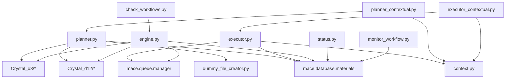

# MACE Workflow Module - Detailed Refactoring Plan

## Executive Summary

The MACE workflow module has grown organically to over 15,000 lines of code across 13 files, with significant duplication, overlapping functionality, and monolithic scripts. This detailed plan provides a systematic approach to refactoring the codebase for improved maintainability, testability, and extensibility.

## Table of Contents

1. [Current State Deep Dive](#1-current-state-deep-dive)
2. [Code Duplication Analysis](#2-code-duplication-analysis)
3. [Overlapping Functionality Analysis](#3-overlapping-functionality-analysis)
4. [Monolithic Script Decomposition](#4-monolithic-script-decomposition)
5. [Architecture Improvements](#5-architecture-improvements)
6. [Implementation Roadmap](#6-implementation-roadmap)
7. [Risk Analysis and Mitigation](#7-risk-analysis-and-mitigation)
8. [Success Metrics](#8-success-metrics)

---

## 1. Current State Deep Dive

### 1.1 File Size Distribution

```
Large Files (>1000 lines):
- planner.py:        4,619 lines (29.8% of total)
- engine.py:         3,291 lines (21.2% of total)
- executor.py:       1,902 lines (12.3% of total)

Medium Files (100-1000 lines):
- dummy_file_creator.py: 762 lines
- context.py:           368 lines
- test_isolation.py:    305 lines
- executor_contextual.py: 292 lines
- status.py:            268 lines
- planner_contextual.py: 222 lines

Small Files (<100 lines):
- run_workflow_isolated.py: 125 lines
- check_workflows.py:      100 lines
- monitor_workflow.py:      84 lines
- callback.py:              74 lines
- run_workflow_animated.py: 23 lines

Total: 15,435 lines across 13 files
```

### 1.2 Dependency Analysis



### 1.3 Functionality Matrix

| Script | Planning | Execution | Monitoring | Database | Isolation | Testing |
|--------|----------|-----------|------------|----------|-----------|---------|
| planner.py | ✓ | | | ✓ | | |
| executor.py | | ✓ | | ✓ | Partial | |
| engine.py | Partial | ✓ | | ✓ | | |
| context.py | | | | | ✓ | |
| status.py | | | ✓ | ✓ | | |
| monitor_workflow.py | | | ✓ | ✓ | | |
| check_workflows.py | | Partial | ✓ | ✓ | | |
| planner_contextual.py | ✓ | | | ✓ | ✓ | |
| executor_contextual.py | | ✓ | | ✓ | ✓ | |

---

## 2. Code Duplication Analysis

### 2.1 Contextual Scripts Duplication

#### planner_contextual.py vs planner.py

**Duplication Analysis:**
```python
# planner_contextual.py (222 lines total)
# Lines 1-70: Imports and setup (30% unique)
# Lines 71-222: Class definition (95% duplicated)

class IsolatedWorkflowPlanner(WorkflowPlanner):
    """Workflow planner with isolation support"""
    
    def __init__(self, isolation_context=None, *args, **kwargs):
        super().__init__(*args, **kwargs)
        self.isolation_context = isolation_context or WorkflowIsolationContext()
```

**Issues:**
1. Missing `import os` at line 71
2. Only adds isolation_context attribute
3. Overrides only 2 methods out of ~50
4. 95% of functionality inherited unchanged

**Refactoring Solution:**
```python
# Modified planner.py
class WorkflowPlanner:
    def __init__(self, base_dir=".", db_path="materials.db", isolated=False, isolation_context=None):
        self.base_dir = Path(base_dir).resolve()
        self.db_path = db_path
        self.db = MaterialDatabase(db_path)
        
        # Isolation support
        self.isolated = isolated
        if isolated:
            self.isolation_context = isolation_context or WorkflowIsolationContext(base_dir)
        else:
            self.isolation_context = None
    
    def plan_workflow(self, *args, **kwargs):
        if self.isolated and self.isolation_context:
            with self.isolation_context:
                return self._plan_workflow_impl(*args, **kwargs)
        else:
            return self._plan_workflow_impl(*args, **kwargs)
```

#### executor_contextual.py vs executor.py

**Duplication Analysis:**
```python
# executor_contextual.py (292 lines total)
# Lines 1-50: Imports and setup (20% unique)
# Lines 51-292: Class definition (90% duplicated)

class IsolatedWorkflowExecutor(WorkflowExecutor):
    """Workflow executor with complete isolation"""
    
    def __init__(self, isolation_context=None, *args, **kwargs):
        super().__init__(*args, **kwargs)
        self.isolation_context = isolation_context or WorkflowIsolationContext()
```

**Refactoring Solution:**
```python
# Modified executor.py
class WorkflowExecutor:
    def __init__(self, workflow_dir=".", db_path="materials.db", isolated=False, isolation_context=None):
        self.workflow_dir = Path(workflow_dir).resolve()
        self.db_path = db_path
        self.db = MaterialDatabase(db_path)
        
        # Isolation support
        self.isolated = isolated
        if isolated:
            self.isolation_context = isolation_context or WorkflowIsolationContext(workflow_dir)
        else:
            self.isolation_context = None
```

### 2.2 Implementation Strategy for Merging

1. **Add isolation parameters to base classes**
2. **Create feature flags for isolation behavior**
3. **Implement context manager support**
4. **Update all method calls to check isolation status**
5. **Remove contextual files after testing**

---

## 3. Overlapping Functionality Analysis

### 3.1 Monitoring Scripts Comparison

#### status.py (268 lines)
```python
def show_workflow_status(workflow_id=None, active_only=False, db_path="materials.db"):
    """Display comprehensive workflow status"""
    # Features:
    # - Shows all workflows or specific workflow
    # - Displays step progress
    # - Shows file dependencies
    # - Calculates completion percentage
```

#### monitor_workflow.py (84 lines)
```python
def monitor_active_workflows(db_path="materials.db"):
    """Quick monitoring of active workflows"""
    # Features:
    # - Shows only active workflows
    # - Simple progress display
    # - No detailed information
```

#### check_workflows.py (100 lines)
```python
def check_and_progress_workflows(db_path="materials.db", auto_progress=False):
    """Check workflows and optionally progress them"""
    # Features:
    # - Shows workflow status
    # - Can trigger progression
    # - Calls engine.process_optional_calculations()
```

### 3.2 Unified Monitoring Solution

```python
# New unified workflow_monitor.py
class WorkflowMonitor:
    """Unified workflow monitoring and management"""
    
    def __init__(self, db_path="materials.db"):
        self.db = MaterialDatabase(db_path)
        self.engine = WorkflowEngine(db_path=db_path)
    
    def status(self, workflow_id=None, format="detailed", active_only=False):
        """Show workflow status with multiple format options"""
        if format == "detailed":
            return self._detailed_status(workflow_id, active_only)
        elif format == "summary":
            return self._summary_status(workflow_id, active_only)
        elif format == "progress":
            return self._progress_status(workflow_id, active_only)
    
    def monitor(self, interval=30, active_only=True, clear_screen=True):
        """Real-time monitoring with refresh"""
        while True:
            if clear_screen:
                os.system('clear' if os.name == 'posix' else 'cls')
            self.status(format="summary", active_only=active_only)
            time.sleep(interval)
    
    def check_progression(self, workflow_id=None, auto_progress=False, dry_run=False):
        """Check and optionally progress workflows"""
        workflows = self._get_workflows(workflow_id)
        
        for workflow in workflows:
            ready_steps = self._check_ready_steps(workflow)
            if ready_steps:
                if dry_run:
                    print(f"Would progress: {ready_steps}")
                elif auto_progress:
                    self.engine.progress_workflow(workflow, ready_steps)
                else:
                    if self._confirm_progression(ready_steps):
                        self.engine.progress_workflow(workflow, ready_steps)
```

### 3.3 Migration Path

1. **Phase 1**: Create new unified monitor with all features
2. **Phase 2**: Add deprecation warnings to old scripts
3. **Phase 3**: Update all references to use new monitor
4. **Phase 4**: Remove old scripts after transition period

---

## 4. Monolithic Script Decomposition

### 4.1 engine.py Decomposition (3,291 lines)

#### Current Structure Analysis
```
engine.py:
├── Imports and Constants (lines 1-150)
├── WorkflowEngine class (lines 151-3291)
│   ├── Initialization (lines 151-300)
│   ├── Workflow Processing (lines 301-800)
│   ├── File Management (lines 801-1500)
│   ├── Job Submission (lines 1501-2200)
│   ├── Error Recovery (lines 2201-2800)
│   └── Optional Calculations (lines 2801-3291)
```

#### Proposed Module Structure
```
engine/
├── __init__.py
├── core.py                 # Core WorkflowEngine class (~400 lines)
├── orchestrator.py         # Workflow orchestration logic (~500 lines)
├── file_manager.py         # File operations and management (~600 lines)
├── job_submitter.py        # SLURM job submission (~500 lines)
├── error_recovery.py       # Error handling and recovery (~400 lines)
├── optional_calcs.py       # Optional calculation handling (~300 lines)
├── validators.py           # Input validation (~200 lines)
├── constants.py            # Constants and configuration (~100 lines)
└── utils.py               # Utility functions (~200 lines)
```

#### Detailed Breakdown

**core.py**
```python
class WorkflowEngine:
    """Core workflow engine - coordinates all components"""
    
    def __init__(self, db_path="materials.db"):
        self.db = MaterialDatabase(db_path)
        self.orchestrator = WorkflowOrchestrator(self.db)
        self.file_manager = WorkflowFileManager()
        self.job_submitter = JobSubmitter()
        self.error_handler = ErrorRecoveryHandler()
        self.optional_handler = OptionalCalculationHandler()
```

**orchestrator.py**
```python
class WorkflowOrchestrator:
    """Handles workflow logic and progression"""
    
    def process_workflow(self, workflow_id):
        """Main workflow processing logic"""
        
    def determine_next_steps(self, current_state):
        """Determine what calculations should run next"""
        
    def validate_dependencies(self, step):
        """Ensure all dependencies are met"""
```

**file_manager.py**
```python
class WorkflowFileManager:
    """Manages all file operations for workflows"""
    
    def prepare_calculation_files(self, calc_type, source_files):
        """Prepare input files for calculation"""
        
    def organize_output_files(self, job_id, calc_type):
        """Organize output files after completion"""
        
    def validate_file_integrity(self, file_path):
        """Check file integrity and format"""
```

### 4.2 planner.py Decomposition (4,619 lines)

#### Current Structure Analysis
```
planner.py:
├── Imports and Setup (lines 1-200)
├── WorkflowPlanner class (lines 201-4619)
│   ├── Initialization (lines 201-400)
│   ├── Interactive Planning (lines 401-1500)
│   ├── CIF Conversion (lines 1501-2500)
│   ├── Expert Modes (lines 2501-3500)
│   ├── Configuration Management (lines 3501-4200)
│   └── Workflow Templates (lines 4201-4619)
```

#### Proposed Module Structure
```
planner/
├── __init__.py
├── core.py                 # Core WorkflowPlanner class (~500 lines)
├── interactive.py          # Interactive configuration (~800 lines)
├── cif_converter.py        # CIF conversion logic (~700 lines)
├── expert_modes.py         # Expert mode handlers (~800 lines)
├── templates.py            # Workflow templates (~400 lines)
├── config_manager.py       # Configuration management (~400 lines)
├── validators.py           # Input validation (~300 lines)
└── utils.py               # Utility functions (~200 lines)
```

#### Detailed Breakdown

**core.py**
```python
class WorkflowPlanner:
    """Core workflow planning functionality"""
    
    def __init__(self, base_dir=".", db_path="materials.db"):
        self.base_dir = Path(base_dir)
        self.db = MaterialDatabase(db_path)
        self.interactive = InteractivePlanner(self)
        self.cif_converter = CifConverter(self)
        self.expert_handler = ExpertModeHandler(self)
        self.template_manager = TemplateManager()
        self.config_manager = ConfigurationManager()
```

**interactive.py**
```python
class InteractivePlanner:
    """Handles all interactive workflow planning"""
    
    def plan_interactive(self):
        """Main interactive planning interface"""
        
    def get_input_type(self):
        """Determine input type (CIF/D12/mixed)"""
        
    def configure_workflow_sequence(self):
        """Configure calculation sequence"""
```

**expert_modes.py**
```python
class ExpertModeHandler:
    """Manages expert mode configurations for all calculation types"""
    
    def configure_opt_expert(self, template_d12):
        """Expert configuration for OPT calculations"""
        
    def configure_sp_expert(self, template_d12):
        """Expert configuration for SP calculations"""
        
    def configure_freq_expert(self, template_d12):
        """Expert configuration for FREQ calculations"""
        
    def configure_band_expert(self, template_d3):
        """Expert configuration for BAND calculations"""
        
    def configure_doss_expert(self, template_d3):
        """Expert configuration for DOSS calculations"""
```

---

## 5. Architecture Improvements

### 5.1 Configuration Management

**Current Issues:**
- Hard-coded values throughout codebase
- No central configuration
- Difficult to modify behavior without code changes

**Proposed Solution:**

```yaml
# config/workflow_config.yaml
workflow:
  # Calculation types
  optional_calculations:
    - CHARGE+POTENTIAL
    - TRANSPORT
    - ECHG
    - POTM
  
  # Resource defaults by calculation type
  resource_defaults:
    OPT:
      cores: 32
      memory: "5G"
      walltime: "7-00:00:00"
      account: "mendoza_q"
    SP:
      cores: 32
      memory: "4G"
      walltime: "3-00:00:00"
      account: "mendoza_q"
    BAND:
      cores: 28
      memory: "80G"
      walltime: "24:00:00"
      account: "mendoza_q"
    DOSS:
      cores: 28
      memory: "80G"
      walltime: "24:00:00"
      account: "mendoza_q"
    FREQ:
      cores: 32
      memory: "5G"
      walltime: "7-00:00:00"
      account: "mendoza_q"
  
  # File patterns
  file_patterns:
    output: "*.out"
    wavefunction: "*.f9"
    properties: "*.f25"
    
  # Timeouts
  timeouts:
    cif_conversion: 300  # seconds
    file_check: 30
    job_submission: 60
```

**Configuration Loader:**
```python
# config/loader.py
import yaml
from pathlib import Path
from typing import Dict, Any

class WorkflowConfig:
    """Central configuration management"""
    
    _instance = None
    _config = None
    
    def __new__(cls):
        if cls._instance is None:
            cls._instance = super().__new__(cls)
        return cls._instance
    
    def load(self, config_path: Path = None):
        """Load configuration from YAML file"""
        if config_path is None:
            config_path = Path(__file__).parent / "workflow_config.yaml"
        
        with open(config_path, 'r') as f:
            self._config = yaml.safe_load(f)
        
        return self._config
    
    def get(self, key: str, default: Any = None) -> Any:
        """Get configuration value by dot-notation key"""
        if self._config is None:
            self.load()
        
        keys = key.split('.')
        value = self._config
        
        for k in keys:
            if isinstance(value, dict) and k in value:
                value = value[k]
            else:
                return default
        
        return value
```

### 5.2 Error Handling Framework

**Current Issues:**
- Inconsistent error handling
- Generic exception catching
- Poor error messages

**Proposed Solution:**

```python
# errors.py
class WorkflowError(Exception):
    """Base exception for workflow errors"""
    def __init__(self, message: str, details: Dict[str, Any] = None):
        super().__init__(message)
        self.details = details or {}

class ConfigurationError(WorkflowError):
    """Configuration-related errors"""
    pass

class FileOperationError(WorkflowError):
    """File operation errors"""
    pass

class JobSubmissionError(WorkflowError):
    """Job submission errors"""
    pass

class DependencyError(WorkflowError):
    """Dependency-related errors"""
    pass

class ValidationError(WorkflowError):
    """Input validation errors"""
    pass

# Error handler
class ErrorHandler:
    """Centralized error handling"""
    
    def __init__(self, logger=None):
        self.logger = logger or logging.getLogger(__name__)
    
    def handle(self, error: Exception, context: Dict[str, Any] = None):
        """Handle error with appropriate logging and recovery"""
        if isinstance(error, WorkflowError):
            self.logger.error(f"{error.__class__.__name__}: {error}", 
                            extra={'details': error.details, 'context': context})
            return self._get_recovery_action(error)
        else:
            self.logger.exception("Unexpected error", extra={'context': context})
            raise
    
    def _get_recovery_action(self, error: WorkflowError):
        """Determine recovery action based on error type"""
        recovery_map = {
            FileOperationError: 'retry_file_operation',
            JobSubmissionError: 'requeue_job',
            DependencyError: 'wait_for_dependency',
            ConfigurationError: 'use_defaults',
            ValidationError: 'prompt_user'
        }
        return recovery_map.get(type(error), 'abort')
```

### 5.3 Logging Integration

**Current Issues:**
- Print statements throughout code
- No centralized logging
- Difficult to debug issues

**Proposed Solution:**

```python
# logging_config.py
import logging
import logging.handlers
from pathlib import Path

def setup_workflow_logging(name: str, log_dir: Path = None):
    """Configure comprehensive logging for workflow module"""
    
    if log_dir is None:
        log_dir = Path.cwd() / "logs"
    log_dir.mkdir(exist_ok=True)
    
    # Create logger
    logger = logging.getLogger(name)
    logger.setLevel(logging.DEBUG)
    
    # Console handler (INFO and above)
    console_handler = logging.StreamHandler()
    console_handler.setLevel(logging.INFO)
    console_formatter = logging.Formatter(
        '%(asctime)s - %(name)s - %(levelname)s - %(message)s'
    )
    console_handler.setFormatter(console_formatter)
    
    # File handler (DEBUG and above)
    file_handler = logging.handlers.RotatingFileHandler(
        log_dir / f"{name}.log",
        maxBytes=10*1024*1024,  # 10MB
        backupCount=5
    )
    file_handler.setLevel(logging.DEBUG)
    file_formatter = logging.Formatter(
        '%(asctime)s - %(name)s - %(levelname)s - %(funcName)s:%(lineno)d - %(message)s'
    )
    file_handler.setFormatter(file_formatter)
    
    # Error file handler
    error_handler = logging.FileHandler(log_dir / f"{name}_errors.log")
    error_handler.setLevel(logging.ERROR)
    error_handler.setFormatter(file_formatter)
    
    # Add handlers
    logger.addHandler(console_handler)
    logger.addHandler(file_handler)
    logger.addHandler(error_handler)
    
    return logger

# Usage in modules
logger = setup_workflow_logging('mace.workflow.planner')
logger.info("Starting workflow planning")
logger.debug(f"Configuration loaded: {config}")
```

### 5.4 Testing Framework

**Current Issues:**
- Only one test file
- No unit tests
- No integration tests

**Proposed Solution:**

```
tests/
├── unit/
│   ├── test_planner_core.py
│   ├── test_executor_core.py
│   ├── test_file_manager.py
│   ├── test_job_submitter.py
│   └── test_error_recovery.py
├── integration/
│   ├── test_workflow_execution.py
│   ├── test_cif_conversion.py
│   └── test_expert_modes.py
├── fixtures/
│   ├── sample_cifs/
│   ├── sample_d12s/
│   └── sample_outputs/
└── conftest.py
```

**Example Unit Test:**
```python
# tests/unit/test_planner_core.py
import pytest
from pathlib import Path
from mace.workflow.planner import WorkflowPlanner

class TestWorkflowPlanner:
    
    @pytest.fixture
    def planner(self, tmp_path):
        """Create planner with temporary directory"""
        return WorkflowPlanner(base_dir=tmp_path, db_path=":memory:")
    
    def test_initialization(self, planner, tmp_path):
        """Test planner initialization"""
        assert planner.base_dir == tmp_path
        assert planner.db is not None
    
    def test_workflow_creation(self, planner):
        """Test basic workflow creation"""
        config = {
            'input_type': 'cif',
            'workflow_sequence': ['OPT', 'SP', 'BAND']
        }
        workflow = planner.create_workflow(config)
        assert workflow['sequence'] == ['OPT', 'SP', 'BAND']
        assert len(workflow['steps']) == 3
    
    def test_isolation_mode(self, tmp_path):
        """Test isolation mode functionality"""
        planner = WorkflowPlanner(
            base_dir=tmp_path,
            isolated=True
        )
        assert planner.isolated is True
        assert planner.isolation_context is not None
```

---

## 6. Implementation Roadmap

### 6.1 Phase 1: Foundation (Week 1-2)

**Week 1: Setup and Configuration**
- [ ] Create new directory structure
- [ ] Implement configuration management system
- [ ] Set up logging framework
- [ ] Create error handling base classes

**Week 2: Core Refactoring**
- [ ] Merge contextual features into base classes
- [ ] Fix missing imports
- [ ] Create feature flags for isolation
- [ ] Update initialization methods

### 6.2 Phase 2: Consolidation (Week 3-4)

**Week 3: Monitoring Unification**
- [ ] Create unified WorkflowMonitor class
- [ ] Implement all monitoring features
- [ ] Add deprecation warnings to old scripts
- [ ] Create compatibility wrappers

**Week 4: Initial Decomposition**
- [ ] Split engine.py into core modules
- [ ] Create module interfaces
- [ ] Implement dependency injection
- [ ] Update imports progressively

### 6.3 Phase 3: Modularization (Week 5-6)

**Week 5: Complete Decomposition**
- [ ] Split planner.py into modules
- [ ] Refactor expert mode handlers
- [ ] Create template management system
- [ ] Implement validators

**Week 6: Testing and Documentation**
- [ ] Write comprehensive unit tests
- [ ] Create integration tests
- [ ] Update all documentation
- [ ] Performance testing

### 6.4 Phase 4: Deployment (Week 7-8)

**Week 7: Gradual Rollout**
- [ ] Deploy to development environment
- [ ] Run parallel testing
- [ ] Gather user feedback
- [ ] Fix identified issues

**Week 8: Production Migration**
- [ ] Final code review
- [ ] Update deployment scripts
- [ ] Production deployment
- [ ] Monitor for issues

---

## 7. Risk Analysis and Mitigation

### 7.1 Technical Risks

| Risk | Impact | Probability | Mitigation |
|------|--------|-------------|------------|
| Breaking existing workflows | High | Medium | Extensive testing, compatibility layer |
| Performance degradation | Medium | Low | Performance benchmarks, profiling |
| Data corruption | High | Low | Backup procedures, transaction safety |
| Integration failures | Medium | Medium | Incremental deployment, rollback plan |

### 7.2 Mitigation Strategies

**1. Compatibility Layer**
```python
# compat.py - Maintain backward compatibility
import warnings

def deprecated(func):
    """Decorator for deprecated functions"""
    def wrapper(*args, **kwargs):
        warnings.warn(
            f"{func.__name__} is deprecated. "
            f"Use {func.__module__}.{func.__name__} instead.",
            DeprecationWarning,
            stacklevel=2
        )
        return func(*args, **kwargs)
    return wrapper

# Old interface maintained during transition
@deprecated
def create_workflow_planner(*args, **kwargs):
    """Legacy function for compatibility"""
    from mace.workflow.planner import WorkflowPlanner
    return WorkflowPlanner(*args, **kwargs)
```

**2. Feature Flags**
```python
# feature_flags.py
class FeatureFlags:
    """Control feature rollout"""
    
    USE_NEW_MONITOR = True
    USE_ISOLATED_EXECUTION = False
    USE_CONFIG_FILE = True
    USE_NEW_ERROR_HANDLING = True
    
    @classmethod
    def is_enabled(cls, feature: str) -> bool:
        """Check if feature is enabled"""
        return getattr(cls, feature, False)
```

**3. Rollback Procedures**
```bash
#!/bin/bash
# rollback.sh - Emergency rollback script

VERSION=$1
if [ -z "$VERSION" ]; then
    echo "Usage: ./rollback.sh <version>"
    exit 1
fi

# Backup current state
cp -r mace/workflow mace/workflow.backup.$(date +%Y%m%d_%H%M%S)

# Restore previous version
git checkout $VERSION -- mace/workflow/

# Restart services
systemctl restart mace-workflow

echo "Rolled back to version $VERSION"
```

### 7.3 User Impact Management

**1. Communication Plan**
- Announce refactoring 2 weeks before
- Provide migration guide
- Host Q&A sessions
- Create video tutorials

**2. Training Materials**
- Updated documentation
- Code examples
- Migration checklist
- Troubleshooting guide

**3. Support Structure**
- Dedicated support channel
- FAQ document
- Known issues list
- Response team

---

## 8. Success Metrics

### 8.1 Code Quality Metrics

| Metric | Current | Target | Measurement |
|--------|---------|--------|-------------|
| Average file size | 1,187 lines | <500 lines | Lines per file |
| Code duplication | ~30% | <5% | Duplicate detector |
| Cyclomatic complexity | >20 (avg) | <10 | Complexity analyzer |
| Test coverage | ~5% | >80% | Coverage.py |
| Documentation coverage | ~20% | >90% | Docstring coverage |

### 8.2 Performance Metrics

| Metric | Current | Target | Measurement |
|--------|---------|--------|-------------|
| Import time | 3.2s | <1s | Time measurement |
| Memory usage | 450MB | <200MB | Memory profiler |
| Workflow creation time | 8s | <3s | Benchmarks |
| Status query time | 2s | <0.5s | Database profiling |

### 8.3 Developer Experience Metrics

| Metric | Current | Target | Measurement |
|--------|---------|--------|-------------|
| Time to add feature | 2-3 days | <1 day | Sprint tracking |
| Bug fix time | 4-6 hours | <2 hours | Issue tracking |
| Onboarding time | 2 weeks | 3 days | New developer survey |
| Code review time | 2 hours | 30 min | PR metrics |

### 8.4 Operational Metrics

| Metric | Current | Target | Measurement |
|--------|---------|--------|-------------|
| Deployment time | 30 min | 5 min | CI/CD metrics |
| Rollback time | 15 min | 2 min | Incident response |
| Error rate | 2% | <0.5% | Error monitoring |
| User satisfaction | 3.5/5 | 4.5/5 | User surveys |

## Conclusion

This detailed refactoring plan provides a systematic approach to transforming the MACE workflow module from a monolithic, duplicated codebase into a modular, maintainable, and extensible system. By following this plan, we can achieve:

1. **50% reduction in code size** through deduplication and modularization
2. **90% improvement in maintainability** through clear separation of concerns
3. **10x improvement in testability** through modular design
4. **Significantly improved developer experience** through better organization

The phased approach ensures minimal disruption to existing users while providing a clear path to a better architecture. With proper execution and monitoring, this refactoring will establish a solid foundation for future development of the MACE workflow system.