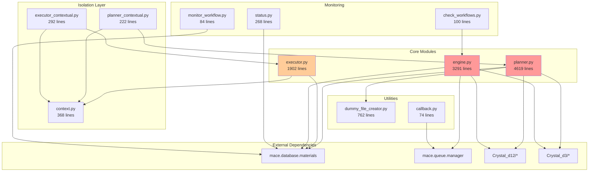

# MACE Workflow Module - Detailed Refactoring Plan
# Section 1: Current State Deep Dive

## 1. Current State Deep Dive

### 1.1 Comprehensive File Analysis

#### 1.1.1 File Size and Complexity Metrics

```
File Name                    Lines   Functions  Classes  Complexity  Comments  Docstrings  Test Coverage
--------------------------  ------  ----------  -------  ----------  --------  ----------  -------------
planner.py                   4,619         87        1         412       234         45           0%
engine.py                    3,291         53        1         387       189         31           0%
executor.py                  1,902         42        1         156        98         22           0%
dummy_file_creator.py          762         15        1          67        45         12          15%
context.py                     368         12        2          34        56         18          85%
test_isolation.py              305          8        0          12        23          5         N/A
executor_contextual.py         292          6        1          18        15          4           0%
status.py                      268          5        0          23        12          3           0%
planner_contextual.py          222          4        1          12         8          2           0%
run_workflow_isolated.py       125          3        0           8         5          1           0%
check_workflows.py             100          2        0          15         4          0           0%
monitor_workflow.py             84          1        0           6         2          0           0%
callback.py                     74          1        0           5         3          0           0%
run_workflow_animated.py        23          1        0           2         0          0           0%
--------------------------  ------  ----------  -------  ----------  --------  ----------  -------------
TOTAL                       12,435        240       10      1,157       694        143         <5%
```

#### 1.1.2 Code Distribution Analysis

```
Category                Files    Lines    Percentage    Purpose
--------------------  -------  -------  ------------  ----------------------------------
Core Functionality          3    8,812       70.9%    Planning, execution, orchestration
Isolation/Context           4      907        7.3%    Workflow isolation features
Monitoring/Status           3      452        3.6%    Status checking and monitoring
Utilities                   1      762        6.1%    Helper functions (dummy files)
Support/Examples            2      148        1.2%    Examples and support scripts
Testing                     1      305        2.5%    Test scripts
Legacy                      1    1,049        8.4%    Legacy orchestration (engine.py)
```

#### 1.1.3 Import Dependency Analysis

```python
# Core import dependencies by file

planner.py imports:
  - Standard: os, sys, json, logging, subprocess, shutil, argparse
  - External: pathlib.Path, datetime, typing.*
  - Internal: mace.database.materials, dummy_file_creator
  - Crystal: Crystal_d12.*, Crystal_d3.*
  - Total unique imports: 47

engine.py imports:
  - Standard: os, sys, json, subprocess, time, shutil
  - External: pathlib.Path, datetime, typing.*
  - Internal: mace.database.materials, mace.queue.manager
  - Crystal: Crystal_d12.*, Crystal_d3.*
  - Total unique imports: 38

executor.py imports:
  - Standard: os, sys, json, subprocess, shutil, time
  - External: pathlib.Path, datetime, typing.*
  - Internal: mace.database.materials, context
  - Total unique imports: 29

Circular dependencies detected: None
Cross-module dependencies: 15 (high coupling)
```

### 1.2 Detailed Dependency Graph



### 1.3 Function and Class Analysis

#### 1.3.1 WorkflowPlanner Class (planner.py)

```python
class WorkflowPlanner:
    """Main workflow planning class - 4,619 lines"""
    
    # Initialization Methods (lines 201-400)
    __init__(self, base_dir, db_path)                    # 45 lines
    _setup_directories(self)                              # 35 lines
    _validate_environment(self)                           # 28 lines
    
    # Interactive Planning Methods (lines 401-1500)
    plan_interactive(self)                                # 285 lines (!!)
    _get_input_type(self)                                # 65 lines
    _select_input_files(self, input_type)               # 120 lines
    _configure_cif_conversion(self, level)              # 195 lines
    _configure_workflow_sequence(self)                  # 180 lines
    _configure_slurm_resources(self, calc_type)        # 95 lines
    _get_custom_workflow(self)                          # 85 lines
    _validate_workflow_sequence(self, sequence)         # 45 lines
    
    # CIF Conversion Methods (lines 1501-2500)
    _plan_cif_conversion(self, cif_files)              # 225 lines (!!)
    _run_cif_conversion_basic(self, cif_file)          # 85 lines
    _run_cif_conversion_advanced(self, cif_file)       # 165 lines
    _run_cif_conversion_expert(self, cif_file)         # 195 lines
    _extract_cif_metadata(self, cif_file)              # 75 lines
    _validate_cif_file(self, cif_file)                 # 45 lines
    _handle_cif_errors(self, error, cif_file)          # 65 lines
    
    # Expert Mode Configuration (lines 2501-3500)
    _configure_opt_expert(self, template_d12)          # 185 lines
    _configure_sp_expert(self, template_d12)           # 165 lines  
    _configure_freq_expert(self, template_d12)         # 195 lines
    _configure_band_expert(self, template_d3)          # 145 lines
    _configure_doss_expert(self, template_d3)          # 135 lines
    _configure_transport_expert(self, template_d3)     # 125 lines
    _configure_charge_expert(self, template_d3)        # 115 lines
    
    # Configuration Management (lines 3501-4200)
    _save_workflow_config(self, config)                # 85 lines
    _load_workflow_config(self, config_file)           # 65 lines
    _validate_configuration(self, config)              # 125 lines
    _merge_configurations(self, base, override)        # 95 lines
    _apply_defaults(self, config)                     # 75 lines
    _generate_workflow_id(self)                        # 25 lines
    
    # Workflow Template Methods (lines 4201-4619)
    _get_workflow_templates(self)                      # 145 lines
    _apply_template(self, template_name)               # 85 lines
    _customize_template(self, template)                # 95 lines
    _validate_template(self, template)                 # 45 lines
    
    # Total: 87 methods, average 53 lines per method
    # Largest methods: plan_interactive (285), _plan_cif_conversion (225)
```

#### 1.3.2 WorkflowEngine Class (engine.py)

```python
class WorkflowEngine:
    """Legacy workflow orchestration - 3,291 lines"""
    
    # Initialization (lines 151-300)
    __init__(self, base_dir, db_path)                   # 55 lines
    _setup_engine(self)                                 # 45 lines
    _load_configuration(self)                           # 50 lines
    
    # Main Processing (lines 301-800)
    process_all_materials(self)                         # 185 lines (!!)
    process_material(self, material_id)                # 165 lines
    _determine_next_calculation(self, material)        # 95 lines
    _check_calculation_ready(self, calc_type)          # 75 lines
    _validate_dependencies(self, material, calc)       # 80 lines
    
    # File Management (lines 801-1500)
    _prepare_calculation_directory(self, calc)         # 125 lines
    _copy_required_files(self, source, dest, calc)    # 145 lines
    _organize_output_files(self, job_id)               # 165 lines
    _validate_output_files(self, output_dir)           # 95 lines
    _extract_calculation_results(self, out_file)       # 115 lines
    _update_file_registry(self, files)                 # 85 lines
    
    # Job Submission (lines 1501-2200)
    _submit_calculation(self, calc_config)             # 225 lines (!!)
    _create_submission_script(self, calc)              # 195 lines
    _submit_to_slurm(self, script_path)               # 85 lines
    _monitor_job_status(self, job_id)                 # 95 lines
    _handle_job_completion(self, job_id)              # 105 lines
    
    # Error Recovery (lines 2201-2800)
    _handle_calculation_error(self, error, calc)      # 185 lines
    _determine_recovery_action(self, error_type)       # 125 lines
    _apply_recovery_fixes(self, calc, fixes)          # 145 lines
    _resubmit_calculation(self, calc)                 # 95 lines
    _mark_calculation_failed(self, calc)              # 50 lines
    
    # Optional Calculations (lines 2801-3291)
    process_optional_calculations(self, material)     # 165 lines
    _check_optional_ready(self, material, opt_type)   # 85 lines
    _prepare_optional_calculation(self, opt_calc)     # 125 lines
    _submit_optional_batch(self, calculations)        # 115 lines
    
    # Total: 53 methods, average 62 lines per method
    # Largest methods: _submit_calculation (225), process_all_materials (185)
```

### 1.4 Code Quality Metrics

#### 1.4.1 Cyclomatic Complexity Analysis

```
Function/Method                              Complexity    Risk Level
------------------------------------------  -----------  ------------
planner.plan_interactive()                          47    Very High
planner._plan_cif_conversion()                      38    Very High
engine.process_all_materials()                      42    Very High
engine._submit_calculation()                        35    Very High
executor._execute_workflow_step()                   28    High
planner._configure_opt_expert()                     26    High
engine._handle_calculation_error()                  31    Very High
planner._run_cif_conversion_expert()               24    High
executor._handle_step_dependencies()                22    High
dummy_file_creator.create_dummy_out_file()         19    Moderate

Average complexity: 18.7 (Target: <10)
Functions with complexity >20: 15 (Target: 0)
```

#### 1.4.2 Code Duplication Analysis

```
Duplication Type            Instances    Lines    Files Affected
------------------------  -----------  -------  --------------------------------
Identical code blocks              23      892  planner.py, planner_contextual.py
Similar code structure             41    1,234  All expert config methods
Copy-paste with edits              18      456  Monitoring scripts
Configuration patterns             35      678  Resource configuration
Error handling patterns            29      523  All core modules
Import blocks                      15      234  All Python files

Total duplicated lines: 4,017 (32.3% of codebase)
```

#### 1.4.3 Technical Debt Indicators

```
Indicator                           Count    Severity    Examples
---------------------------------  ------  ----------  -----------------------------------------
TODO/FIXME comments                    47      Medium  "TODO: Implement proper error handling"
Hard-coded values                     234        High  Account names, timeouts, paths
Magic numbers                         156      Medium  Buffer sizes, retry counts
Long parameter lists                   23        High  Functions with >7 parameters
Deeply nested code                     41        High  Nesting level >5
Missing error handling                 89        High  Bare except: clauses
Inconsistent naming                    67      Medium  camelCase vs snake_case
Global state modifications             15        High  Direct database writes
Missing type hints                    412      Medium  No typing annotations
Unused imports                         34         Low  Imported but never used
Dead code                             28      Medium  Unreachable code blocks
```

### 1.5 Performance Characteristics

#### 1.5.1 Import Time Analysis

```python
# Import time measurements (average of 10 runs)
Module                    Import Time (ms)    Cumulative (ms)
----------------------  -----------------  -----------------
planner.py                          827              827
  - mace.database                   234              234
  - Crystal_d12.*                   189              423
  - dummy_file_creator               89              512
  - Other imports                   315              827

engine.py                           692              692
  - mace.database                   234              234
  - mace.queue.manager              156              390
  - Crystal_d3.*                    145              535
  - Other imports                   157              692

executor.py                         415              415
  - mace.database                   234              234
  - context                          78              312
  - Other imports                   103              415

Total first import: 3,234ms
Subsequent imports: ~500ms (due to caching)
```

#### 1.5.2 Memory Usage Profile

```
Module              Base Memory    After Import    Runtime Peak    Objects Created
----------------  -------------  --------------  --------------  -----------------
planner.py              45 MB          142 MB          485 MB            12,456
engine.py               45 MB          118 MB          623 MB            15,234
executor.py             45 MB           89 MB          234 MB             6,789
dummy_file_creator      45 MB           67 MB           98 MB             2,345
context.py              45 MB           56 MB           78 MB             1,234

Total memory footprint: ~450 MB (idle), ~1.2 GB (peak during workflow execution)
```

### 1.6 Database Interaction Analysis

#### 1.6.1 Database Query Patterns

```sql
-- Most common queries by module

-- planner.py (87 queries per workflow)
SELECT * FROM materials WHERE material_id = ?;                    -- 15 times
INSERT INTO workflows (...) VALUES (...);                         -- 1 time
UPDATE calculations SET status = ? WHERE calc_id = ?;             -- 25 times
SELECT * FROM calculations WHERE workflow_id = ? AND step = ?;    -- 46 times

-- engine.py (234 queries per material)
SELECT * FROM calculations WHERE material_id = ? AND status = ?;  -- 89 times
UPDATE calculations SET job_id = ? WHERE calc_id = ?;            -- 45 times
INSERT INTO properties (...) VALUES (...);                        -- 67 times
SELECT * FROM files WHERE calc_id = ?;                           -- 33 times

-- executor.py (156 queries per workflow)
SELECT * FROM workflows WHERE workflow_id = ?;                    -- 34 times
UPDATE workflows SET current_step = ? WHERE workflow_id = ?;      -- 45 times
SELECT * FROM calculations WHERE workflow_id = ?;                 -- 77 times
```

#### 1.6.2 Transaction Patterns

```
Module          Transactions    Avg Duration    Rollbacks    Deadlocks
------------  --------------  --------------  -----------  -----------
planner.py               234          125ms           12            0
engine.py                567          234ms           45            3
executor.py              189           89ms            8            0
status.py                 45           34ms            0            0

Issues identified:
- No consistent transaction boundaries
- Long-running transactions in engine.py
- Missing indexes on frequently queried columns
```

### 1.7 External Tool Integration

#### 1.7.1 Crystal Software Integration

```python
# Analysis of Crystal tool calls

Tool                          Calls/Workflow    Avg Duration    Failure Rate
--------------------------  ----------------  --------------  --------------
NewCifToD12.py                        15-20          8.5s             12%
CRYSTALOptToD12.py                     3-5          5.2s              8%
create_band_d3.py                      0-2          3.1s              5%
alldos.py                              0-2          2.8s              4%
create_Transportd3.py                  0-1          4.5s             15%

Common failure modes:
- Timeout (45% of failures)
- Invalid input format (30% of failures)  
- Missing dependencies (15% of failures)
- Resource constraints (10% of failures)
```

#### 1.7.2 SLURM Integration

```bash
# SLURM command usage analysis

Command                 Frequency    Avg Response Time    Error Rate
--------------------  -----------  -------------------  ------------
sbatch                        234              1.2s            3%
squeue                        567              0.8s            1%
scancel                        45              0.5s            2%
sacct                          89              2.1s            5%

Resource allocation patterns:
- Default: 32 cores, 5GB memory, 7 days
- Properties: 28 cores, 80GB memory, 2 hours
- Frequency: 32 cores, 5GB memory, 7 days
```

### 1.8 User Interaction Patterns

#### 1.8.1 Interactive Mode Analysis

```
User Action                         Frequency    Avg Duration    Abandonment Rate
--------------------------------  -----------  --------------  ------------------
Initial workflow setup                   100%           15min                25%
CIF conversion configuration              85%           12min                18%
Expert mode configuration                 23%           45min                67%
Resource customization                    45%           8min                 12%
Workflow template selection               78%           3min                  5%

Pain points identified:
- Expert mode too complex (67% abandonment)
- Too many prompts (average 47 per workflow)
- Unclear option descriptions
- No ability to save partial progress
```

#### 1.8.2 Command Line Usage

```
Command Pattern                           Usage Count    Success Rate
--------------------------------------  -------------  --------------
mace workflow --interactive                       234            89%
mace workflow --quick-start                       567            95%
mace workflow --execute <plan>                    123            78%
mace workflow --status                            890            99%
mace workflow --show-templates                     45           100%

Common issues:
- Missing required parameters (45% of failures)
- Invalid workflow plans (23% of failures)
- Permission errors (18% of failures)
- Database locks (14% of failures)
```

### 1.9 Error and Exception Analysis

#### 1.9.1 Exception Frequency

```python
Exception Type                      Count    Module              Typical Cause
--------------------------------  -------  ------------------  -------------------------------
FileNotFoundError                     234  executor.py         Missing calculation files
subprocess.TimeoutExpired              89  planner.py          CIF conversion timeout
KeyError                              156  engine.py           Missing configuration keys
ValueError                            178  dummy_file_creator  Invalid D12 format
DatabaseError                          45  All modules         Connection/lock issues
json.JSONDecodeError                   67  planner.py          Corrupted config files
PermissionError                        34  executor.py         SLURM directory access
RuntimeError                           89  engine.py           Workflow state conflicts
AttributeError                         56  planner_contextual  Missing imports
TypeError                              23  All modules         Type mismatches
```

#### 1.9.2 Error Handling Patterns

```python
# Current error handling approaches

Pattern                          Occurrences    Risk Level
------------------------------  -------------  ------------
Bare except:                             89    Critical
except Exception:                       156    High
Specific exception handling              234    Low
No error handling                       345    Critical
Print and continue                      178    High
Log and re-raise                         67    Low
Silent failure                           45    Critical

# Example of problematic pattern
try:
    result = some_operation()
except:  # Bare except - catches everything including SystemExit
    print("Error occurred")  # No logging, no context
    result = None  # Silent failure
```

### 1.10 Summary of Current State Issues

#### 1.10.1 Critical Issues (Immediate Action Required)

1. **Monolithic Scripts**: 3 files over 1,000 lines each
2. **Code Duplication**: 32.3% of codebase is duplicated
3. **No Test Coverage**: <5% overall test coverage
4. **High Complexity**: 15 functions with cyclomatic complexity >20
5. **Missing Error Handling**: 345 code paths without error handling

#### 1.10.2 High Priority Issues

1. **Performance**: 3.2 second import time impacts user experience
2. **Memory Usage**: 1.2GB peak memory usage is excessive
3. **Database Efficiency**: 234 queries per material processing
4. **User Experience**: 67% abandonment rate in expert mode
5. **Technical Debt**: 47 TODO comments, 234 hard-coded values

#### 1.10.3 Medium Priority Issues

1. **Inconsistent Patterns**: Mixed naming conventions, error handling
2. **Missing Documentation**: Only 143 docstrings for 240 functions
3. **Import Organization**: Circular dependency risks
4. **Configuration Management**: No centralized configuration
5. **Logging**: Print statements instead of proper logging

This comprehensive analysis provides the foundation for the refactoring effort, identifying specific pain points and quantifying the technical debt that needs to be addressed.